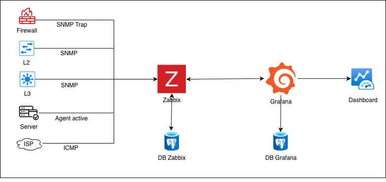

# Monitoring System Zabbix & Grafana

## 📌 Project Overview

This project demonstrates a monitoring infrastructure built using **Zabbix** and **Grafana**, deployed in a virtualized environment with **Hyper-V**.

The system is designed to:

- Collect infrastructure metrics.
- Generate trigger-based alerts.
- Store monitoring data in PostgreSQL.
- Visualize real-time metrics through Grafana dashboards.

---

## 🏗 System Architecture

The monitoring system is deployed across two Ubuntu virtual machines hosted on Windows Server (Hyper-V).

---

## 🖥 Infrastructure Design

### 🔹 Host Machine
- Windows Server 2025
- Hyper-V Virtualization

### 🔹 Ubuntu VM_01
- Zabbix Server
- PostgreSQL

### 🔹 Ubuntu VM_02
- Docker
- Grafana
- PostgreSQL

---

## 🔄 Monitoring Workflow

Zabbix Agent collects metrics from monitored hosts -> Zabbix Server processes data -> PostgreSQL stores monitoring metrics -> Triggers generate events when thresholds are exceeded -> Zabbix API exposes monitoring data -> Grafana queries PostgreSQL -> Admin monitors system through dashboards.

---

## 🔔 Alert Flow

Host → Zabbix Agent → Zabbix Server → Trigger → Event → Zabbix API → Grafana Dashboard → Admin.

---

## 🔐 Key Features

- Centralized monitoring system.
- Trigger-based alerting.
- API integration.
- Dashboard visualization.
- Multi-VM architecture.
- Containerized Grafana deployment.

---

## 🤵🏿 Author

Truong Quang Phuc
