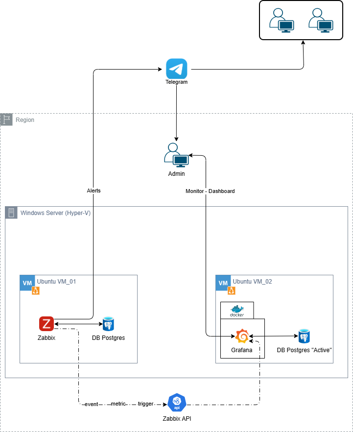

# 🚀 Monitoring System – Zabbix & Grafana

## 📌 Project Overview

This project demonstrates a monitoring infrastructure built using **Zabbix** and **Grafana**, deployed in a virtualized environment with **Hyper-V**.

The system is designed to:

- Collect infrastructure metrics
- Generate trigger-based alerts
- Store monitoring data in PostgreSQL
- Visualize real-time metrics through Grafana dashboards

---

## 🏗 System Architecture

The monitoring system is deployed across two Ubuntu virtual machines hosted on Windows Server (Hyper-V).

---

## 🖥 Infrastructure Design

### 🔹 Host Machine
- Windows Server 2025
- Hyper-V Virtualization

### 🔹 VM 1 – Ubuntu_VM_01
- Zabbix Server
- PostgreSQL (Zabbix Database)

### 🔹 VM 2 – Ubuntu_VM_02
- Docker Engine
- Grafana (Containerized)
- PostgreSQL (Active Database)

---

## 🔄 Monitoring Workflow

1. Zabbix Agent collects metrics from monitored hosts
2. Zabbix Server processes data
3. PostgreSQL stores monitoring metrics
4. Triggers generate events when thresholds are exceeded
5. Zabbix API exposes monitoring data
6. Grafana queries PostgreSQL
7. Admin monitors system through dashboards

---

## 🔔 Alert Flow

Host → Zabbix Agent → Zabbix Server → Trigger → Event → Zabbix API → Grafana Dashboard → Admin  

---

## 🛠 Technology Stack

| Layer | Technology |
|--------|------------|
| Monitoring | Zabbix |
| Visualization | Grafana |
| Database | PostgreSQL |
| Virtualization | Hyper-V |
| Containerization | Docker |
| OS | Ubuntu Server |

---

## 📂 Project Structure

monitoring-system-ZABBIX_GRAFANA/  
│  
├── README.md  
├── docs/  
│   └── images/  
│       └── architecture.png  
├── zabbix/  
├── grafana/  
└── docker/  

---

## 🔐 Key Features

- Centralized monitoring system
- Trigger-based alerting
- API integration
- Dashboard visualization
- Multi-VM architecture
- Containerized Grafana deployment

---

## 🚀 Future Improvements

- High Availability (Zabbix HA)
- Load Balancing
- Database Replication
- Backup & Restore Strategy
- CI/CD Integration
- Infrastructure as Code (Terraform / Ansible)

---

## 👤 Author

Truong Quang Phuc
